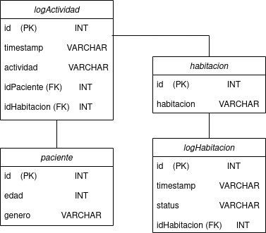

# Practica2 BD2

Practica2 bases de datos 2, backups incrementales, diferenciales y completos en Postgresql (trabajado en trios)

---
Para crear la instancia de la base de datos se deben seguir los pasos del README de la practica1 

NOTA:
La carpeta `/database` es sustituida por la carpeta `/src` y los Dockerfiles son ligeramente distintos, usar el Dockerfile de `Practica2/src/Dockerfile`

## Diagrama de la base de datos

Se debe cargar el script `/sql/ddl/create.sql` para crear el modelo
 
## Pasos para crear el backup
Se deben seguir todos los pasos que estan marcados con **negrita** para verificar si se subieron los backups al volumen 

**entrar al volumen**
`docker exec -it postgres /bin/bash`

**Cambiar contraseña de usuario root por sino se sabe la contraseña**
`passwd`

**Entrar al usuario postgres**

`su - postgres`

**ejecutar pgbackrest para ver que todo bien**

`pgbackrest`

**Verificar que se haya creado la stanza**

`pgbackrest --stanza=bd2_2s24 --log-level-console=info check`

Si no esta creada crear el stanza para realmente inicializar repositorio de backups en pgbackrest

`pgbackrest --stanza=bd2_2s24 --log-level-console=info stanza-create`

si se quiere hacer un backup completo se puede hacer de la siguiente manera

`pgbackrest --stanza=bd2_2s24 --type=full --log-level-console=info backup`

Crear un backup diferencial

`pgbackrest --stanza=bd2_2s24 --type=diff --log-level-console=info backup`

Crear un backup incremental

`pgbackrest --stanza=bd2_2s24 --type=incr --log-level-console=info backup`

**Verificar que se haya creado el backup en el volumen**

`pgbackrest info` 

