# Practica2 BD2

Practica2 bases de datos 2, backups incrementales, diferenciales y completos en Postgresql (trabajado en trios)

---
Para crear la instancia de la base de datos se deben seguir los pasos del README de la practica1 

NOTA:
La carpeta `/database` es sustituida por la carpeta `/src` y los Dockerfiles son ligeramente distintos, usar el Dockerfile de `Practica2/src/Dockerfile`

```
docker run -d --name postgres -v /home/gerhard/Escritorio/USAC/-BD2_Practica1_C202004796_G4/Practica2/src/pg1-path:/var/lib/postgresql/data -v /home/gerhard/Escritorio/USAC/-BD2_Practica1_C202004796_G4/Practica2/src/backup:/backups -p 5432:5432 custom-postgres
```

## Diagrama de la base de datos


Se debe cargar el script `/sql/ddl/create.sql` para crear el modelo
 
## Pasos para crear un backup

entrar al volumen
`docker exec -it postgres /bin/bash`

Cambiar contraseña de usuario root por sino se sabe la contraseña

`passwd`

Entrar al usuario postgres

`su - postgres`

ejecutar pgbackrest para ver que todo bien

`pgbackrest`

Verificar que se haya creado la stanza

`pgbackrest --stanza=bd2_2s24 --log-level-console=info check`

Si no esta creada crear el stanza para realmente inicializar repositorio de backups en pgbackrest

`pgbackrest --stanza=bd2_2s24 --log-level-console=info stanza-create`

Crear un backup completo

`pgbackrest --stanza=bd2_2s24 --type=full --log-level-console=info backup`

Crear un backup diferencial

`pgbackrest --stanza=bd2_2s24 --type=diff --log-level-console=info backup`

Crear un backup incremental

`pgbackrest --stanza=bd2_2s24 --type=incr --log-level-console=info backup`

Verificar que se haya creado el backup en el volumen

`pgbackrest info` 

---

## Dia1 
Se crearon los Datos y se inseratorn a la db

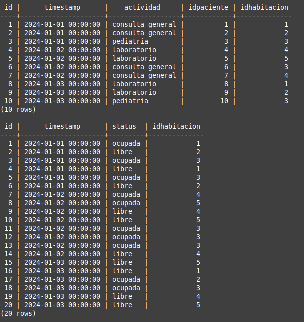
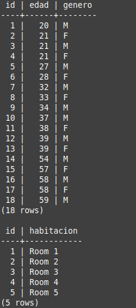

Se simula una falla controlada en la db eliminando el archivo `src/pg1-path/global/pg_control`
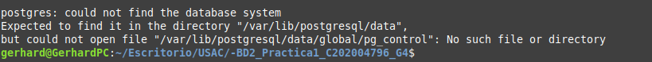

Por lo que no se podra levantar la imagen de la db anterior por la falta de este documento
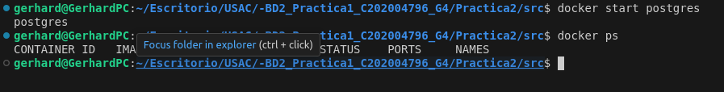


Se debe crear un contenedor temporal para utilizar los backups para restaurar los archivos perdidos y se debe ejecutar el script en modo sudo `src/clean_pg1-path.sh` para eliminiar todos los elementos de pg1-path 
```
docker run -d --name temporal-postgres -v /home/gerhard/Escritorio/USAC/-BD2_Practica1_C202004796_G4/Practica2/src/pg1-path:/var/lib/postgresql/data -v /home/gerhard/Escritorio/USAC/-BD2_Practica1_C202004796_G4/Practica2/src/backup:/backups -p 5432:5432 custom-postgres bash -c "chown -R postgres:postgres /backups && su - postgres -c 'pgbackrest --stanza=bd2_2s24 --log-level-console=info restore'"
```
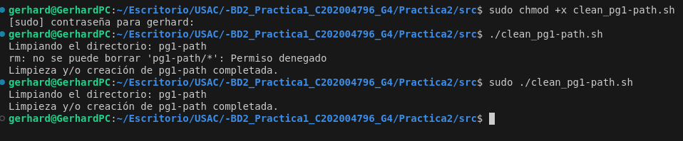
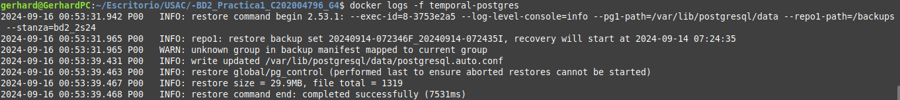

Por ultimo se levanta el contenedor original con toda la data restaurada
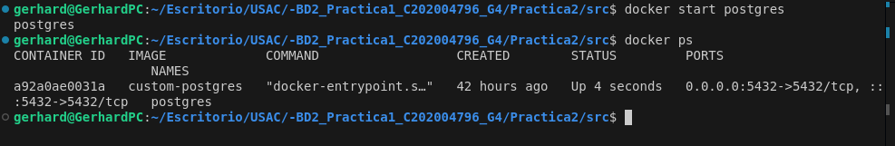

NOTA:
Estos pasos se deberan seguir para la "perdida" y la restauracion de la data en dias posteriores

## Dia2 
Se realizaron inserts masivos con el script `sql/dml/dia2.sql` y se imprime el count de las tablas para verificar que si se agregaron 

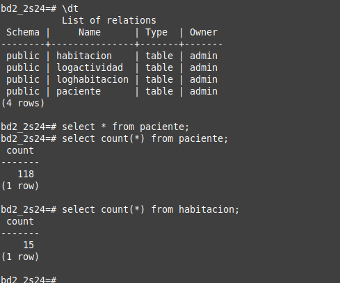

Se crea un backup incremental 
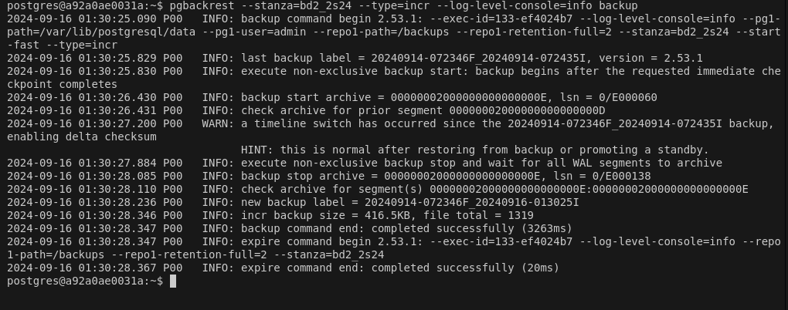
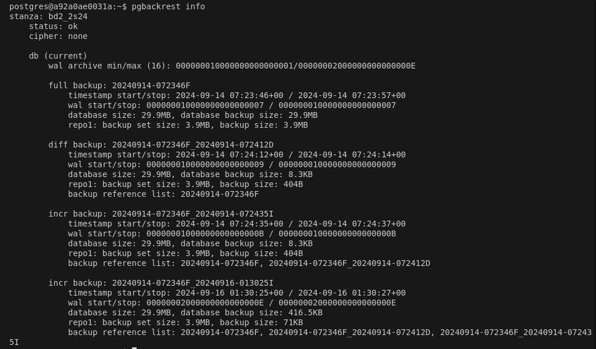

Se simula una falla controlada en la db eliminando el archivo `src/pg1-path/global/pg_control`
Se restaura la db creando una imagen temporal de postgres 

## Dia3 
Se realizaron inserts masivos con el script `sql/dml/dia3.sql` y se imprime el count de las tablas para verificar que si se agregaron 


Se crea un backup incremental 

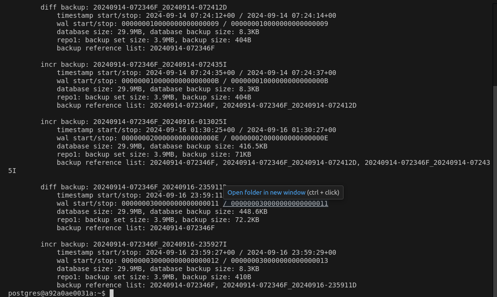

Se simula una falla controlada en la db eliminando el archivo `src/pg1-path/global/pg_control`
Se restaura la db creando una imagen temporal de postgres 

## Dia4
Se realizaron inserts masivos con el script `sql/dml/dia4.sql` y se imprime el count de las tablas para verificar que si se agregaron 

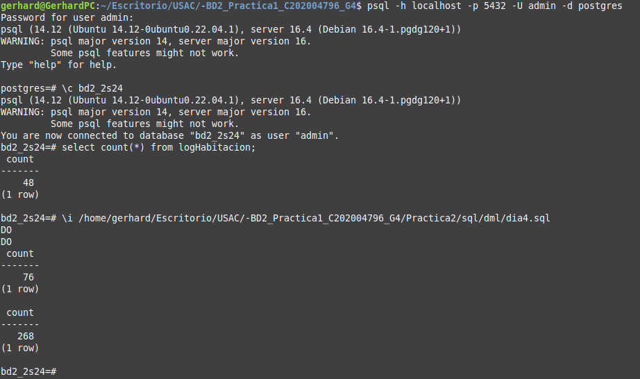

Se crea un backup incremental 
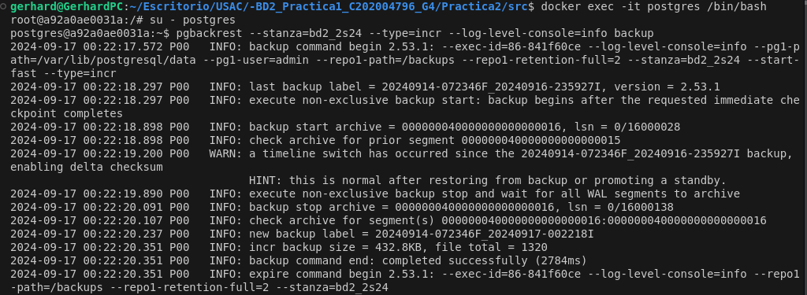

Se crea un backup diferencial 
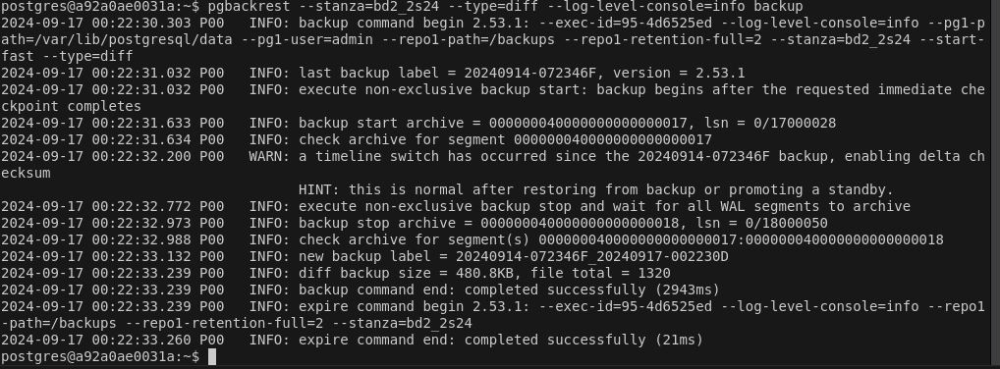

Se crea un backup completo 
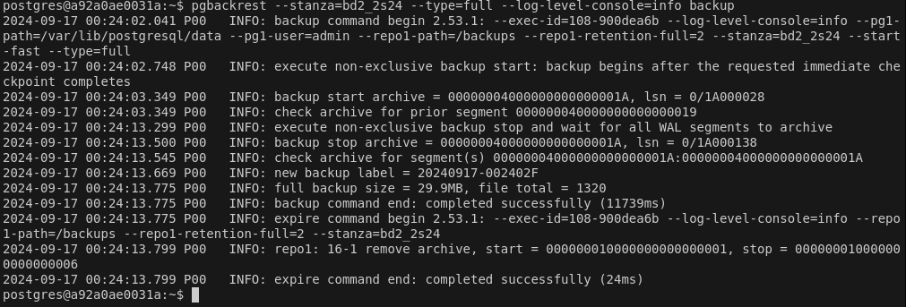

Se crea un segundo backup diferencial 
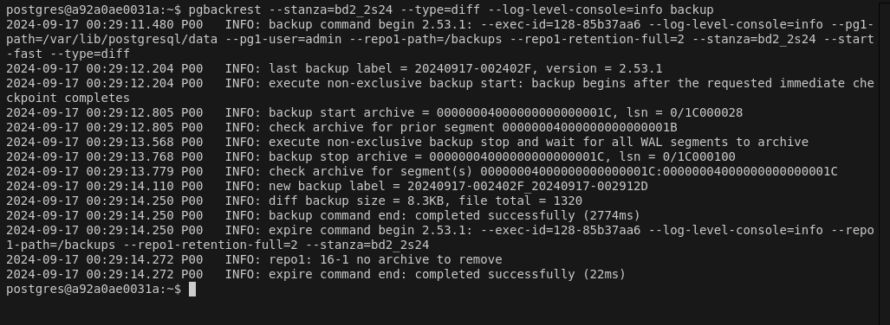

Se crea un segundo backup incremental 
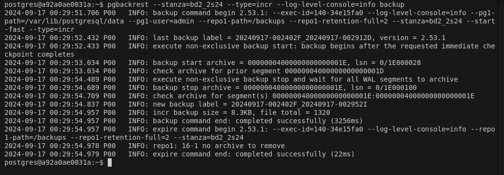

Y se verifican todos los backups 
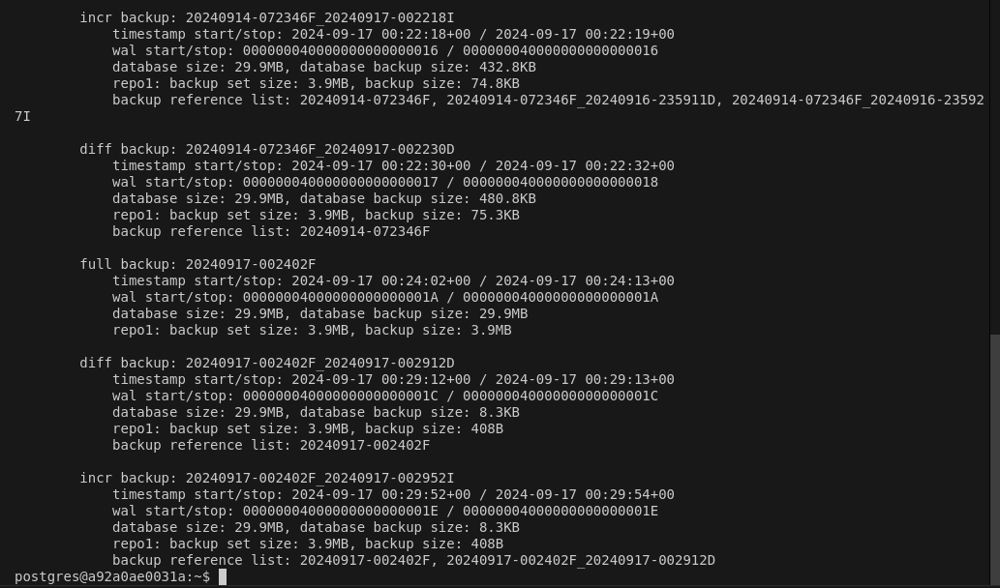


Se simula una falla controlada en la db eliminando el archivo `src/pg1-path/global/pg_control`
Se restaura la db creando una imagen temporal de postgres 


Se simula una falla controlada en la db eliminando el archivo `src/pg1-path/global/pg_control`
Se restaura la db creando una imagen temporal de postgres 
