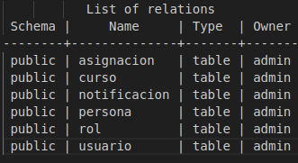

# -BD2_Practica1_C202004796_G4
practica1 bases de datos 2 (trabajado en trios)

## Pasos para iniciar la db Postgres
En vscode abrir la terminal el proyecto y navegar a ./database
`cd database`

Construir la imagen 
`docker build -t custom-postgres .`

Revisar si se creo correctamente con 
`docker images`

Crear el contenedor, para esto se deben tener dos rutas de este proyecto a la mano:
- Path completo de la carpeta ./backup
- Path completo de la carpeta ./pg1-path
Estos pueden ser copiados con "copy path" desde vscode (NOTA: las rutas deben absolutas, no relativas)

Luego crear el conteiner con
```
docker run -d --name postgres -v [RUTA A PG1-PATH]:/var/lib/postgresql/data -v [RUTA A BACKUP]:/backup -p 5432:5432 custom-postgres
```

Ejemplo con MIS RUTAS ABSOLUTAS
```
docker run -d --name postgres -v /home/gerhard/Escritorio/USAC/-BD2_Practica1_C202004796_G4/database/pg1-path:/var/lib/postgresql/data -v /home/gerhard/Escritorio/USAC/-BD2_Practica1_C202004796_G4/database/backup:/backup -p 5432:5432 custom-postgres
```

Verificar con 
`docker ps`

## Conectarse a la db
Pueden utilizar dbeaver o algun otro db manager o conectarse directamente desde la terminal con psql

Pueden descargar psql con los siguientes comandos (Ubuntu/Mint)
```
sudo apt update
sudo apt install postgresql-client
psql --version
```
Y conectarse al contenedor con 
`psql -h localhost -p 5432 -U admin -d postgres`
Les pedira introducir la contraseña (root1234)

La database a utilizar se llamara bd2_2s24, para ver todas las dbs disponibles
`\l`
Para conectarse
`\c bd2_2s24`
Para salir de psql
`\q`

## Para iniciar el contenedor si este está detenido
Si al hacer docker ps no aparece el conetendor, verificar si está detenido con 
`docker ps -a`
Si está alli, levantar el contenedor nuevamente con 
`docker start postgres`

## Ejecutar el script de crceacion de tablas 
Conectarse al contenedor con 
`psql -h localhost -p 5432 -U admin -d postgres`
Les pedira introducir la contraseña (root1234)

La database a utilizar se llamara bd2_2s24, para ver todas las dbs disponibles
`\l`
Para conectarse
`\c bd2_2s24`
Para ejecutar el script de creacion de tablas en sql/ddl/createTAbles.sql
`\i [ABSOLUTE PATH AL SCRIPT]`
Luego confirmar con
`\dt`
La salida deberia ser parecida a esto


